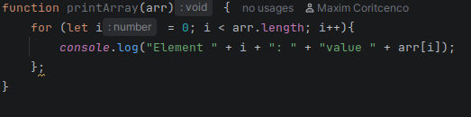
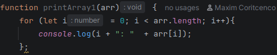
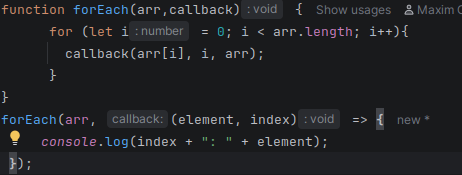
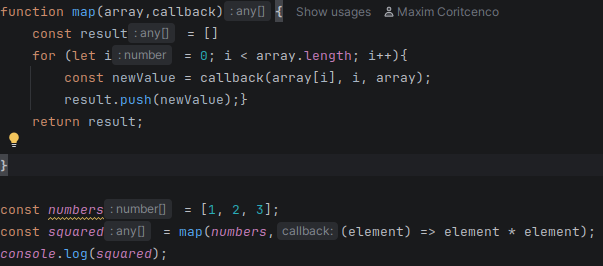
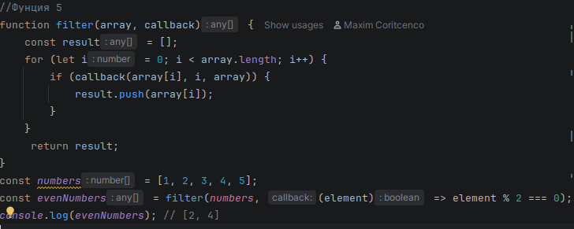
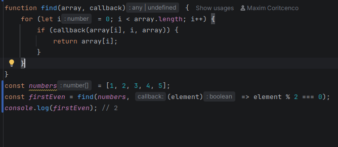
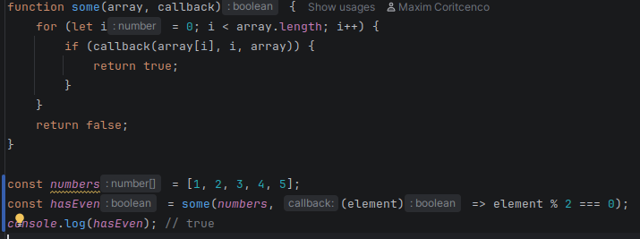
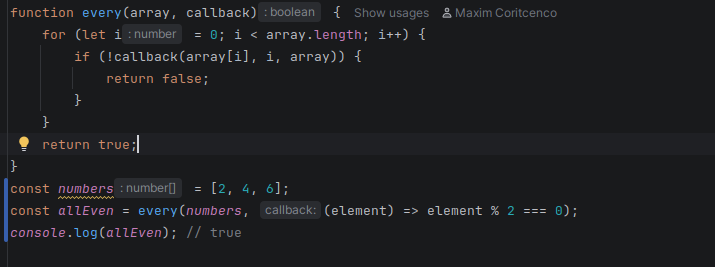
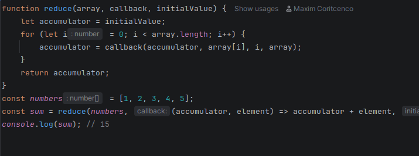

  Первая функция выводи элементы массива, мы просто проходимся по всем элементам и выводим их в консоль.

  Вторая функция делает тоже самое что и первая но между выводом не стоит лишних слов.

  Третья функция использует другую колбэк функция которая делает тоже самое что и первые две функции, но с помощью callback.

  Четвертая функция создает новый массив, который является переработаными элементами  исходного массива через условие callback функции.

  Пятая функция фильтрует массив основываеясь на условии callback.

  Шестая функция выводит первый элемент который попадает под условие callback.

  Седьмая функция выводит True если в массиве есть хотябы 1 элемент который выполняет условие callback, в ином случае выводи False.

  Восьмая функция выводит True если все элементы массива выполняют условие callback, в инос случае выводит False.

  Функция 9 последовательно обрабатывает элементы массива, накапливая результат в аккумуляторе. В моем случае оно складывает все элементы массива и выводит его сумму.

КОНТРОЛЬНЫЕ ВОПРОСЫ:

1.В чем преимущества использования колбэков при работе с массивами?
  Основное преимущество это гибкость кода, одну и ту же функцию можно применять для сотни разных условий. Также это улучшает читаемость и понимае кода, т.к. мы пишем не как перебирнать индекс а что делать с элементом

2.Какие проблемы могут возникать при использовании колбэков и как их избежать?
  Если очень много вкладывать колбэки друг в друга то код станет нечитаемым, избежать это можно тем чтобы использовать более понятнубю структуру без колбэков в колбэке по 100 раз.

3.Как реализовать функции map, filter, find, some, every и reduce без использования встроенных методов массивов?
  Для реализации этих методов можно использовать циклы for и while и callback - функцию, как я использовал в моей работе.