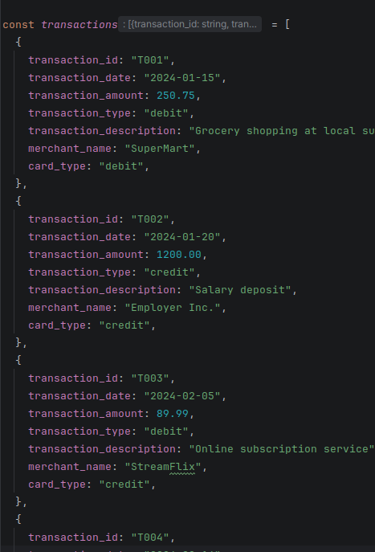

Вначале просто ввод всез массивов по очереди.

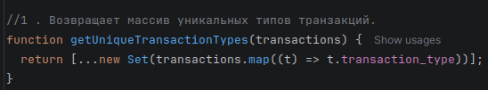

Проходит по массиву, забирает только поле transaction_type у каждого объекта с помощью .map(). Затем передаёт результат в new Set() — конструктор, который автоматически убирает дубликаты. Spread-оператор [...] превращает Set обратно в массив.

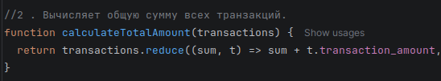

Использует .reduce() — метод, который проходит по массиву и накапливает одно значение. Начинаем с 0 (начальный аккумулятор), и на каждом шаге прибавляем сумму текущей транзакции.

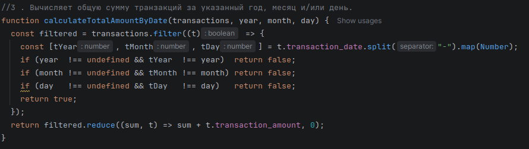

Сначала разбиваем строку даты "2024-02-05" через .split("-") и конвертируем в числа. Затем проверяем: если параметр передан — год/месяц/день должен совпасть. Если параметр undefined — пропускаем проверку. Это делает все три параметра необязательными.

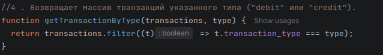

Простая фильтрация через .filter(). Метод проходит по всем элементам и оставляет только те, для которых функция вернула true — то есть те, у кого transaction_type совпадает с переданным параметром.

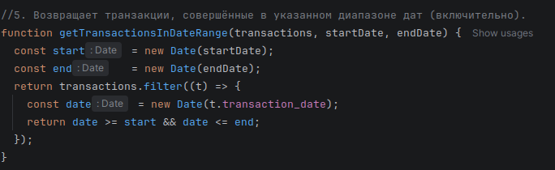

Строки дат конвертируются в объекты Date через new Date(). Это позволяет сравнивать их как числа. Условие date >= start && date <= end включает обе граничные даты.

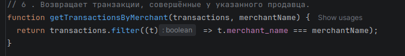

Аналог getTransactionByType, но фильтрует по полю merchant_name. Сравнение строгое (===), регистр важен: "streamflix" не найдёт "StreamFlix".

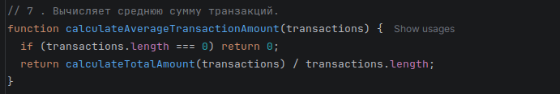

Среднее = сумма / количество. Переиспользуем уже написанную calculateTotalAmount(), делим на transactions.length. Отдельная проверка на пустой массив нужна чтобы избежать деления на ноль (результат был бы NaN).

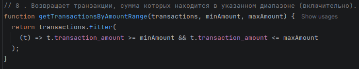

Фильтруем по числовому диапазону. Оба граничных значения включены (>= и <=). Можно передать любые числа — функция вернёт все транзакции между ними.

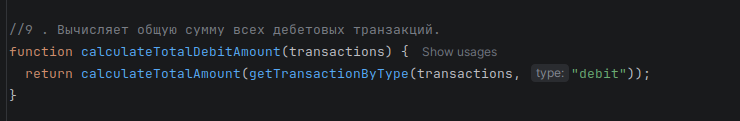

Вместо дублирования кода — композиция функций. Сначала вызываем getTransactionByType(transactions, "debit"), чтобы отфильтровать только дебетовые, затем передаём результат в calculateTotalAmount() для подсчёта суммы.

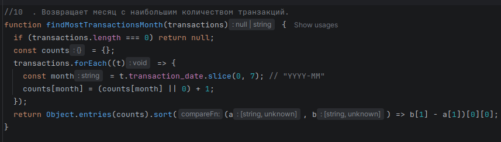

Создаём объект-счётчик counts. Ключ — строка "YYYY-MM" (берём первые 7 символов даты через .slice(0,7)). Для каждой транзакции увеличиваем счётчик на 1. Затем Object.entries() превращает объект в массив пар [ключ, значение], сортируем по убыванию и берём первый элемент.

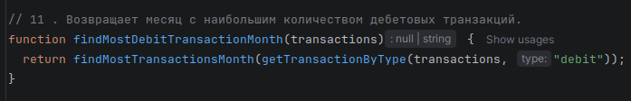

Полностью переиспользует уже написанные функции. Сначала фильтруем только дебетовые транзакции через getTransactionByType(..., "debit"), затем передаём результат в findMostTransactionsMonth().

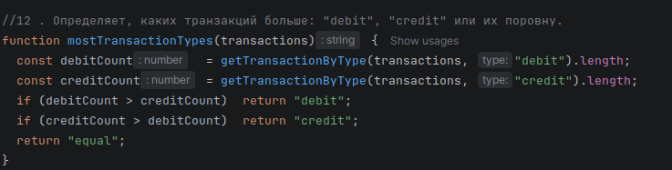

Считаем количество дебетовых и кредитовых транзакций через уже готовую функцию getTransactionByType(), берём .length. Три условия: больше дебетовых, больше кредитовых, или равно.

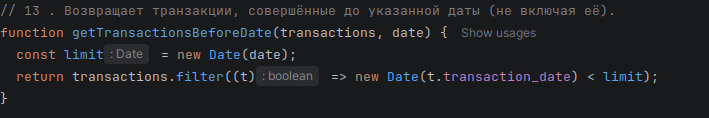

Аналогично getTransactionsInDateRange, но только с верхней границей. Строгое сравнение < — транзакции в точно указанный день не включаются.

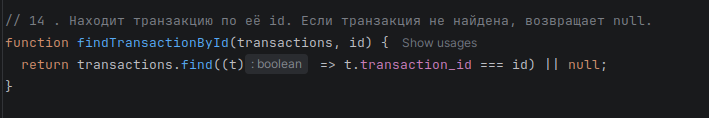

Используем .find() — в отличие от .filter() он останавливается при первом совпадении и возвращает объект (а не массив). Если ничего не найдено, .find() возвращает undefined, поэтому добавляем || null для явного результата.

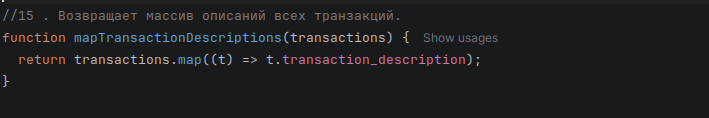

Метод .map() создаёт новый массив той же длины, заменяя каждый элемент на то, что вернёт callback-функция. Здесь мы берём только поле transaction_description — получаем массив строк вместо массива объектов.

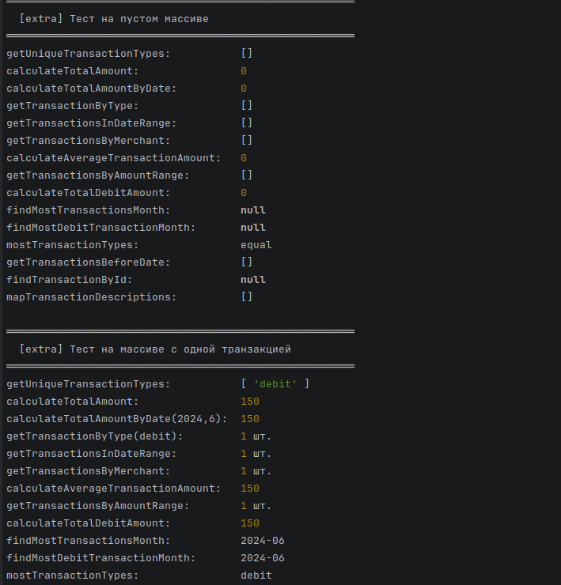

Extra тест на пустом масиве и на массиве с одним элементом.

КОНТРОЛЬНЫЕ ВОПРОСЫ:

1.Какие методы массивов можно использовать для обработки объектов в JavaScript?
  map, filter, reduce, find, some, every, sort, forEach — все они принимают callback, который получает каждый объект поочерёдно.

2.Как сравнивать даты в строковом формате в JavaScript?
  Строки формата "YYYY-MM-DD" можно сравнивать напрямую через > и <, либо конвертировать в new Date() для универсальности.

3.В чем разница между map(), filter() и reduce() при работе с массивами объектов?
  filter отбирает элементы не меняя их, map трансформирует каждый элемент, а reduce сворачивает весь массив в одно значение.
