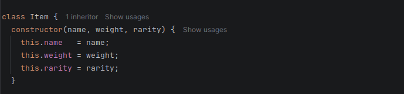
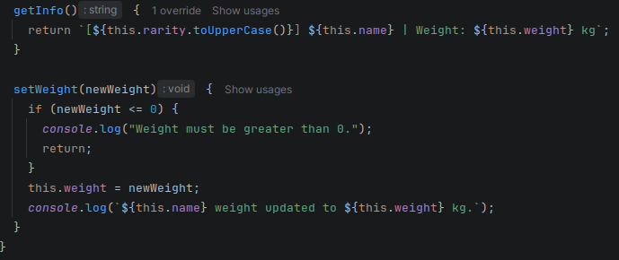
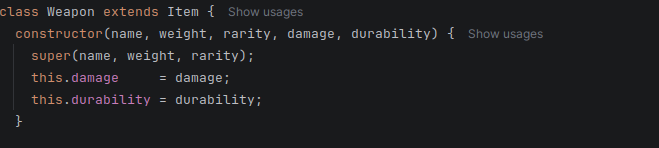
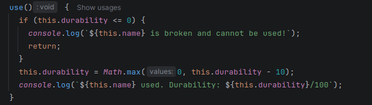
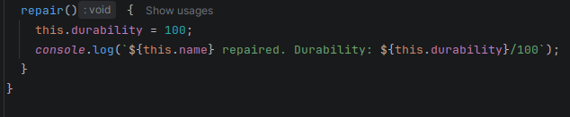
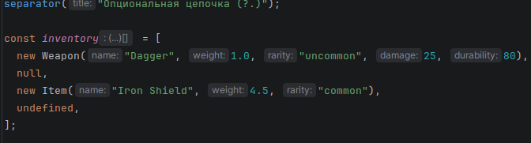
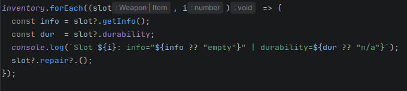
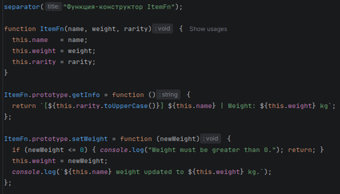

Вначале просто объявление классов Item и Weapon, и создание нескольких объектов для тестирования.

Класс Item с конструктором, принимающим name, weight и rarity. Метод getInfo() возвращает отформатированную строку с информацией о предмете. Метод setWeight() изменяет вес, с проверкой что новый вес больше 0.

Класс Weapon расширяет Item через extends. В конструкторе вызывается super() для передачи полей родителю, затем добавляются свои поля damage и durability. Метод getInfo() переопределён — вызывает super.getInfo() и дописывает к строке урон и прочность.

Метод use() уменьшает durability на 10 при каждом использовании. Math.max(0, durability - 10) не даёт прочности уйти в минус. Если durability уже 0 — выводится сообщение что оружие сломано и метод завершается досрочно через return.

Метод repair() просто выставляет durability обратно в 100. Тест сломанного оружия: создаём Old Axe с durability 10, используем дважды — первый раз доходит до 0, второй раз уже выводит "is broken".

Опциональная цепочка (?.): инвентарь содержит объекты, null и undefined — пустые слоты. Обращение slot?.getInfo() не вызывает ошибку если slot равен null или undefined, просто возвращает undefined. Оператор ?? подставляет "empty" вместо undefined при выводе.

slot?.repair?.() — двойная опциональная цепочка: сначала проверяем что slot существует, затем что у него есть метод repair. У класса Item метода repair нет, поэтому вызов просто пропускается без ошибки.

Функция-конструктор ItemFn — аналог класса Item, но без синтаксиса class. Поля задаются через this внутри функции. Методы добавляются не в тело функции, а на ItemFn.prototype — так они будут общими для всех экземпляров и не будут дублироваться в памяти.

КОНТРОЛЬНЫЕ ВОПРОСЫ:

1. Какое значение имеет this в методах класса?
this ссылается на тот объект, через который был вызван метод — то есть при sword.getInfo() внутри метода this равен sword, и через него доступны все поля экземпляра.
2. Как работает модификатор доступа # в JavaScript?
Поле или метод с префиксом # становится приватным — оно доступно только внутри тела класса, обратиться к нему снаружи через obj.#field невозможно, это вызовет синтаксическую ошибку.
3. В чём разница между классами и функциями-конструкторами?
Классы — это синтаксический сахар над прототипами, они читаемее и удобнее; функции-конструкторы делают то же самое явно, требуя вручную настраивать prototype и вызывать родительский конструктор через .call().